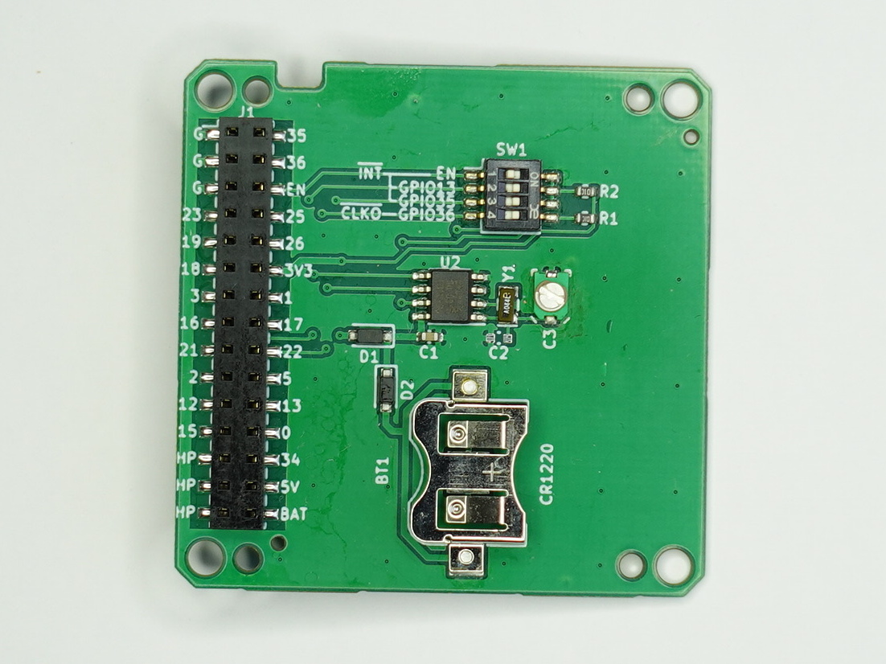

# PCB-MBUS-RTC
PCF8563 RTC Module for M-Bus of M5Stack Basic/Gray

# M5Stack 用 RTC モジュール (M-Bus)

　NXP 社の RTC PCF8563 を搭載した M-BUS モジュールです。RTC を内蔵していない M5Stack Basic, Gray などに使用できます。

委託販売（スイッチサイエンス）：  
https://www.switch-science.com/catalog/7308/

 

## 特徴
- M5Stack 標準の I2C(SCL:GPIO22, SDA:GPIO21) からアクセスできます。
- M-Bus 直結のため配線が不要です。M5Stack の GROVE-A ポートも温存できます。
- M5Stack シリーズで広く採用されている RTC(BM8563) と互換性があり、M5StickC, Core2, M5Paper 用などのソフトウェアを参考にできます。
- コイン電池（別売: CR1220）により、M5Stack の電源がない状態でも時刻を保持し続けます。
- RTC の INT（割り込み出力）をディップスイッチで M-Bus の EN, GPIO13, GPIO35 に接続できます。
- RTC の CLKO（クロック出力）をディップスイッチで M-Bus の GPIO36 に接続できます。
- PROTO モジュールのモールド（別売）を装着することで、他のモジュールやボトムを積み重ねる（スタックする）ことができます。

- トリマコンデンサにより、水晶発振子（クリスタル）の周波数を微調整できます。出荷時には可能な範囲で調整済です。

 
 

## ご注意
- Core2 は RTC (BM8563) を内蔵しており、このモジュールを使用できません。
- 電源スイッチへの配線が M-BUS に存在しないため、Core2 のような RTC による自動電源オンは実現できません。
- 電池 (CR1220) の使用推奨期限は一般に 5 年です。
- INT 信号、CLKO 信号は M5Stack の 3.3V に 10kΩ でプルアップしています。INT, CLKO がローレベルになると電力を消費します。省電力が重要な場合、ウェイクアップなど必要なとき以外はローレベルにしない配慮が必要です。
- ディップスイッチの切り替えには、ピンセット等が必要です。
- PROTO モジュールのモールド（別売）の取り外し・取り付けには、六角ドライバー (1.5mm) が必要です。
- [V01L01] モールドを取り付けるとコイン電池の交換ができません。コイン電池を装着してからモールドを取り付けてください。

## ディップスイッチ

| No. | RTC 出力 | ON 場合の M-Bus 接続先 | 用途 | |
|:-:|:-:|:-:|:-:|:-:|
| 1 | INT | EN | タイマーやアラームにより、M5Stack をリセットする(*1) |
| 2 | INT | GPIO13 | ボトムのピンを消費することなく読み出し/割り込みを行う |
| 3 | INT | GPIO35 | ボトムのピンから監視しながら、読み出し/割り込みを行う |
| 4 | CLKO | GPIO36 | ボトムのピンからクロックを出力する(*2) |

(*1) タイマー設定やアラーム時刻設定により、M5Stack を強制的にリセットすることができます。稼働中の原因不明のハングやメモリーリークなどへの対策として定期的な再起動が必要な場合に利用できるかもしれません。強制リセットからの再起動に失敗する確率はゼロではなく、データ破壊もあり得るなど慎重な検討が必要です。

(*2) ESP32 の問題で GPIO36（および GPIO39）にグリッチが発生します。回避策が以下に書かれています。

macsbug: ButtonA on M5Stack does not work properly

https://macsbug.wordpress.com/2021/05/02/buttona-on-m5stack-does-not-work-properly/

## PROTO モジュールのモールドの流用
### モールドの入手先（スイッチサイエンス扱い）

- [M5Stackプロトモジュール用プラスチックフレーム（2個入）](https://www.switch-science.com/collections/m5stack/products/8450)
- [M5Stack用プロトモジュール [M001]](https://www.switch-science.com/collections/m5stack/products/3650)

   

## GPS で校正した周波数カウンタを用いた発振周波数の調整

詳細は、botanicfields/PCB-RTC-PCF8563-for-M5 を参照ください。

https://github.com/botanicfields/PCB-RTC-PCF8563-for-M5

## サンプルプログラム

### BF-031.ino

- M5Stack の LCD に現在時刻を表示します。時刻は、RTC モジュールおよび NTP から取得します。
- 起動時のリセット原因を表示します。ディップスイッチ 1 が ON の場合、60 秒毎にリセットが発生します。
- 起動中の RTC のレスポンスを OK/ERROR で表示します。
- 起動時に Wi-Fi に接続します。Wi-Fi の設定には、tzapu/WiFiManager を使用しています。
- 起動処理が完了すると、ボタン C の入力待ちになります。

https://github.com/tzapu/WiFiManager

- GPIO36 が LOW の場合 "CLKO" を表示します。CLKO には 1Hz を出力していて、ディップスイッチ 4 が ON の場合 "CLKO" が 1Hz で点滅します。ディップスイッチ 4 が OFF の場合、表示は不定になります。
- GPIO13/GPIO35 の HIGH から LOW への変化を捉えて "GPIO13"/"GPIO35" を 1 秒間表示します。INT にはタイマーにより 60秒 毎にパルスを出力します。ディップスイッチ 2/3 が ON の場合、60 秒毎に "GPIO13"/"GPIO35" が 1 秒間点灯します。この表示には GPIO による割り込みを使用しています。ディップスイッチ 2/3 が OFF の場合、表示は不定になります。

### 上記以外のコードについては、以下を参照ください。

- GitHub: botanicfields/PCB-RTC-PCF8563-for-M5

https://github.com/botanicfields/PCB-RTC-PCF8563-for-M5

- Qiita: M5Atom, M5Stack Core 用の I2C リアルタイムクロック基板を作って動かす

https://qiita.com/BotanicFields/items/dc35e12423be8f6e9b4e

- Qiita: ESP32 において NTP の時刻同期を捕まえて RTC を更新する

https://qiita.com/BotanicFields/items/f1e28af5a63e4ccf7023

- Qiita: ESP32のWiFiおよびtzapu/WiFiManagerにおいて回復処理を試行錯誤した

https://qiita.com/BotanicFields/items/8a73101a8bfe51e57f67
